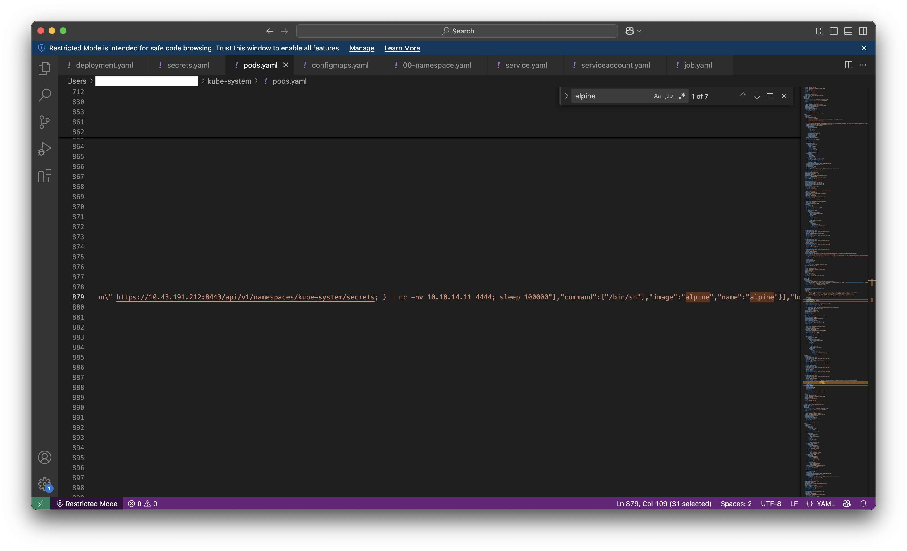

# Kuber
### Malware Analysis (Easy)

First download the `Kuber.zip` file and extract its contents. Focus your attention on the YAML configuration files within the `kube-system` namespace.


**Task 1**
At which NodePort is the `ssh-deployment` Kubernetes service exposed for external access?


The `deployment.yaml` file shows that the container listens on port `2222`. However, this is the internal container port, not the externally exposed port.

To find the NodePort, examine the `service.yaml` file. Locate the `ssh-deployment` service definition:


The `nodePort` field here represents the actual port exposed on the host node that allows external access.


**Task 2**
What is the ClusterIP of the kubernetes cluster?


Search for the keyword `"cluster"` to find the `ClusterIP` specified under the `ssh-deployment` service.


**Task 3**
What is the flag value inside ssh-config configmap?


Search for the keyword `"flag"` within `configmap.yaml` to reveal the embedded flag.


**Task 4**
What is the value of password (in plaintext) which is found inside ssh-deployment via secret?


The password is stored in the `secrets.yaml` file, but it's encoded in **Base64**. You can decode it using [CyberChef](https://gchq.github.io/CyberChef/) or with a simple command like:

```bash
echo 'U3VwZXJDcmF6eVBhc3N3b3JkMTIzIQ==' | base64 -d
```


**Task 5**
What is the name of the malicious pod?

Tasks 5–7 are interconnected, as they all relate to identifying and analyzing malicious activity.

To identify a malicious pod, look for:

- Suspicious images (e.g., alpine:latest, linuxserver/openssh-server)
- Reverse shells or encoded commands
- Abnormal environment variables like PASSWORD, TOKEN
- Sensitive mount paths (e.g., /etc/, /root/, /var/run/docker.sock)
- Elevated permissions (privileged: true, allowPrivilegeEscalation: true)
- Unexpected exposed ports

Search pods.yaml for image references like alpine.



A reverse shell is found pointing to 10.10.14.11:4444, clearly indicating malicious behavior.


**Task 6**
What is the name of the malicious pod?


The pod executing the reverse shell is the one using the alpine image with suspicious shell commands.

**Task 7**
Whats the attacker IP?

As shown in the previous analysis, the attacker's IP is hardcoded in the reverse shell:

**Key Takeaways**
This challenge reinforces key skills in Kubernetes incident response, YAML inspection, base64 decoding, and threat detection through misconfigured containers. We leveraged real-world signs of compromise to identify backdoors and attacker infrastructure.

