# Meerkat
## SOC (Easy)

In this Sherlock, we investigate the `meerkat.pcap` and `meerkat-alert.json` files from HTB Sherlock **Meerkat** to identify and analyze a simulated attack on a Business Management Platform.

**Task 1**
We believe our Business Management Platform server has been compromised. Please can you confirm the name of the application running?

Applying the `http` display filter in Wireshark reveals the application in question: **Bonitasoft**, a business process management (BPM) platform.

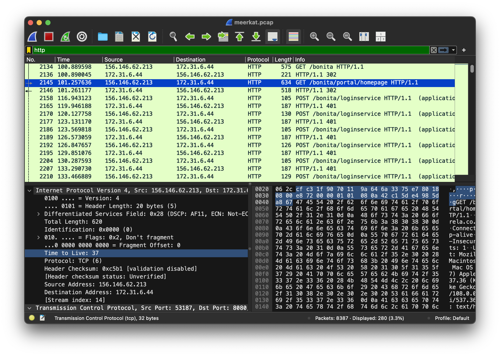

**Task2**
We believe the attacker may have used a subset of the brute forcing attack category - what is the name of the attack carried out?

A series of `POST` requests to `/bonita/loginservice` indicate a **credential stuffing** attack—an automated attempt using reused credentials.

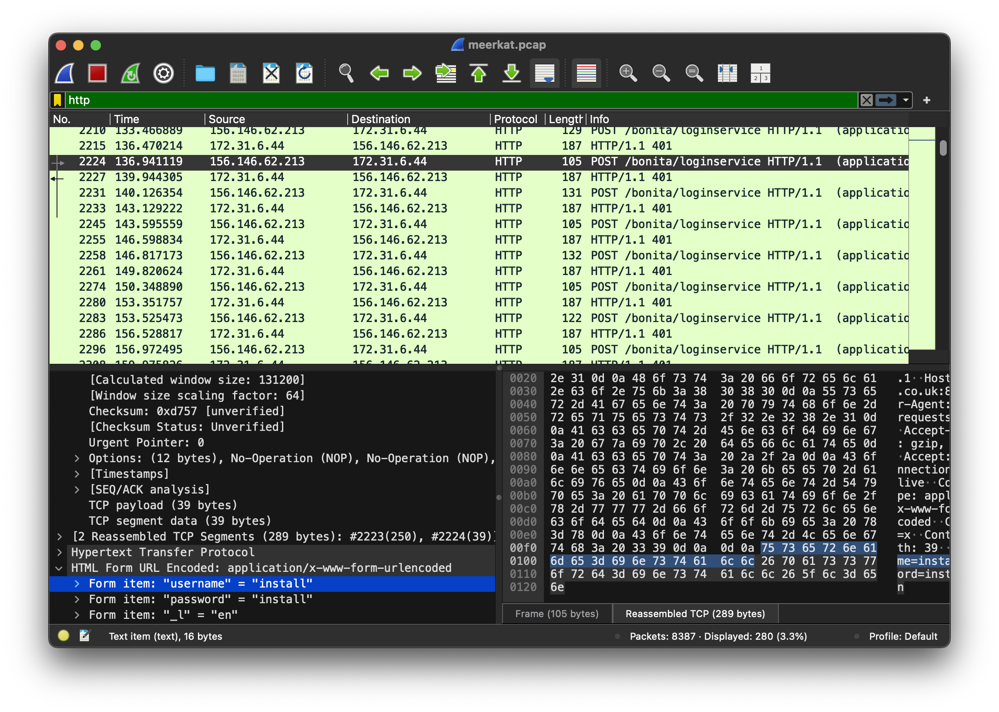
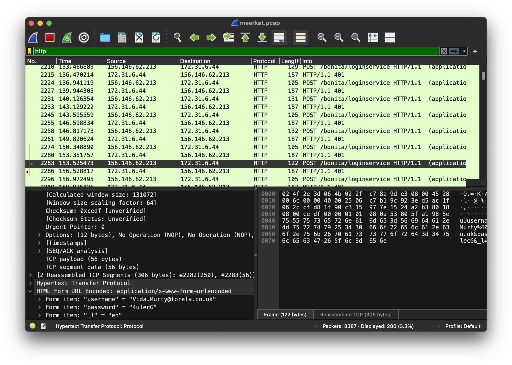

**Task3**
Does the vulnerability exploited have a CVE assigned - and if so, which one?

By examining the `meerkat-alert.json` file and searching for `"CVE"`, we identify the relevant CVE.
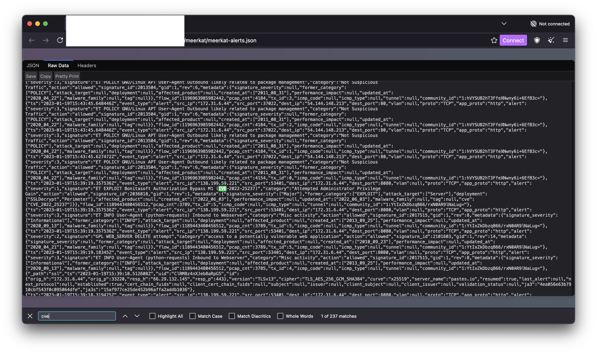

**Task4**
Which string was appended to the API URL path to bypass the authorization filter by the attacker's exploit?

Referencing the CVE details from NVD, the attacker used a specific path manipulation string.

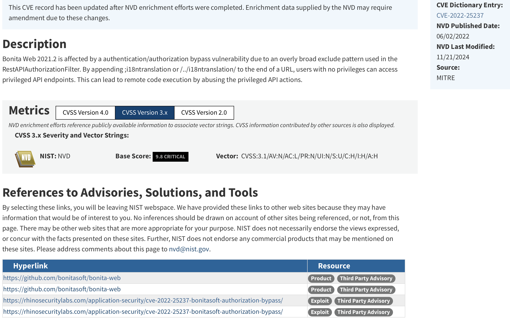

**Task5**
How many combinations of usernames and passwords were used in the credential stuffing attack?

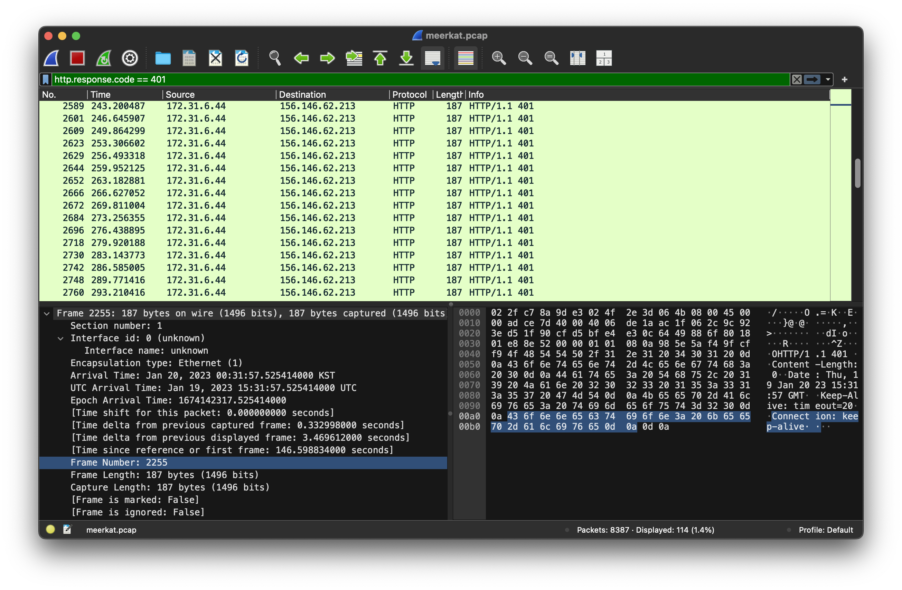
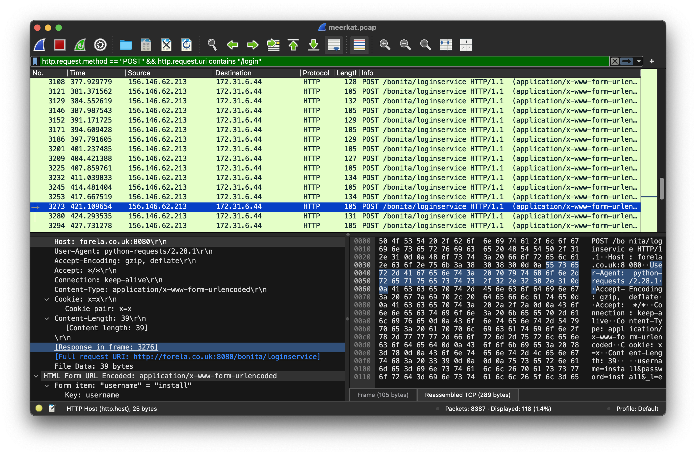

First, I applied the filter `http.response.code == 401` in Wireshark, which returned 114 packets — indicating failed login attempts.

To further isolate the credential stuffing attempts, I used this filter:
`http.request.method == "POST" && http.request.uri contains "/login"`
However, upon manual inspection, I noticed that some of these POST requests were recurring requests using the credentials `install:install`, all with a frame length of 105 bytes. 

To exclude them, I refined the filter to:
`http.request.method == "POST" && http.request.uri contains "/login" && frame.len != 105`
This gave me 59 packets. Further investigation revealed four of these shared the same username (seb.broom@forela.co.uk), indicating retries or duplicate attempts. After removing three duplicates, the final count of unique credential attempts is 56.

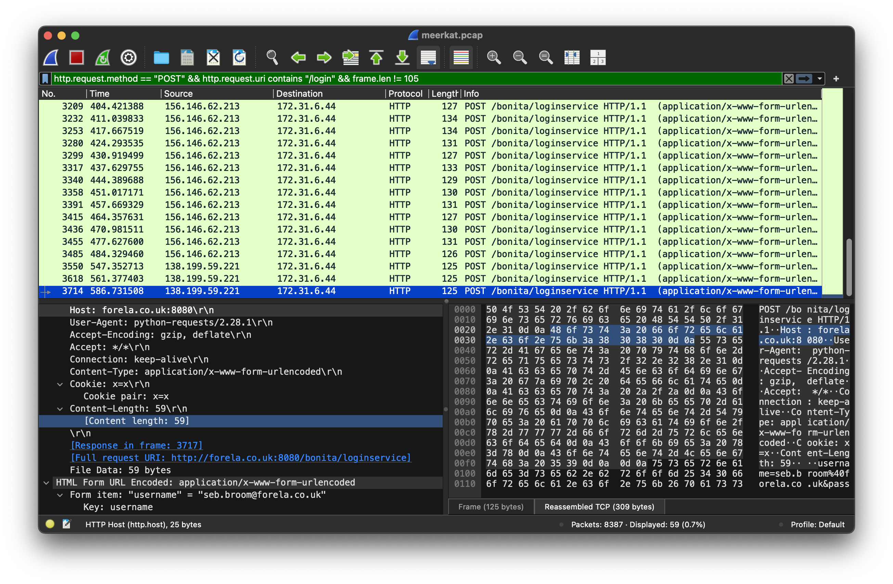

**Task6**
Which username and password combination was successful?

The final packet in the sequence reveals the valid username:password combination used by the attacker.

**Task7**
If any, which text sharing site did the attacker utilise?

At first, I took a bit of a hacky approach. Since HTB hinted that the answer ends with the letter “o”, I immediately thought of sites ending with .io. Based on that hunch, I searched for "io" within the `meerkat-alert.json file` and voilà, I found a reference to https://pastes.io.

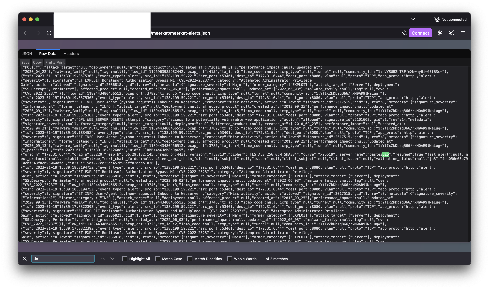

To confirm, I applied the following filter in Wireshark:
`http.request.method == "GET"`
Among the resulting packets, I found the actual wget request made to https://pastes.io, which validated the finding.

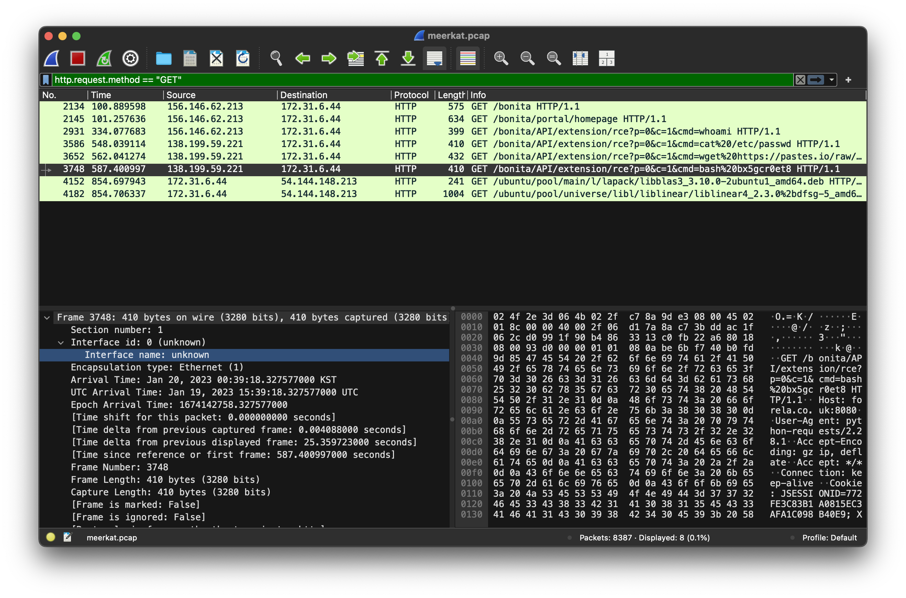

**Task8**
Please provide the filename of the public key used by the attacker to gain persistence on our host.

Accessing the pastes.io URL reveals the public key filename used for persistence.

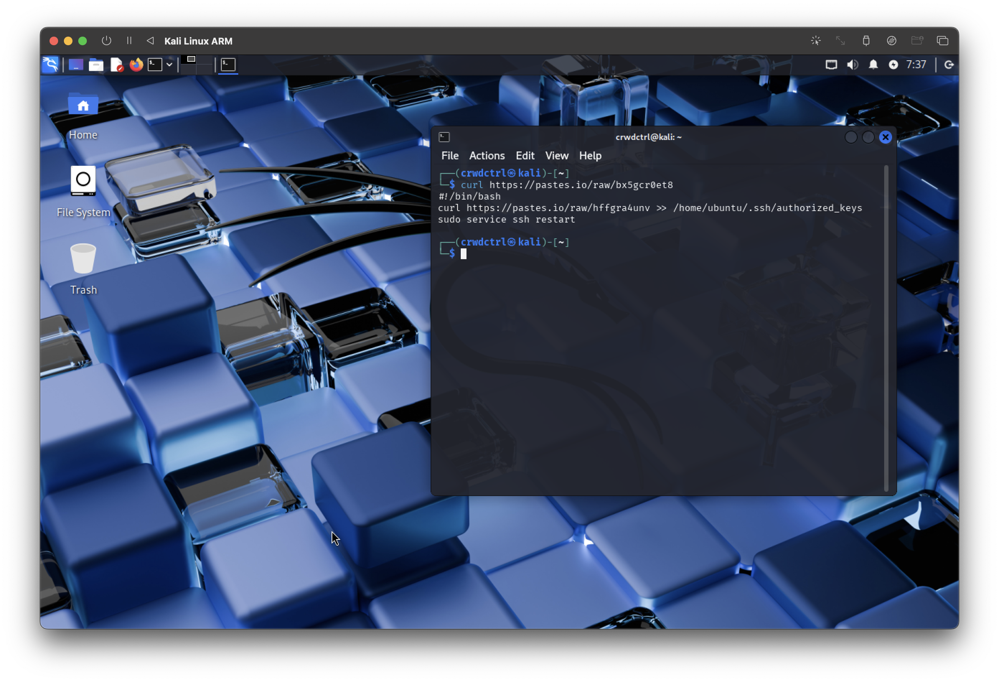

**Task9**
Can you confirm the file modified by the attacker to gain persistence?

As commonly seen in Linux persistence methods, the attacker modified the `authorized_keys` file. (Answer with full path from the above screenshot.)

**Task10**
Can you confirm the MITRE technique ID of this type of persistence mechanism?

Identifying the MITRE technique ID allows us to map the attacker’s method to a standardized adversarial tactic.

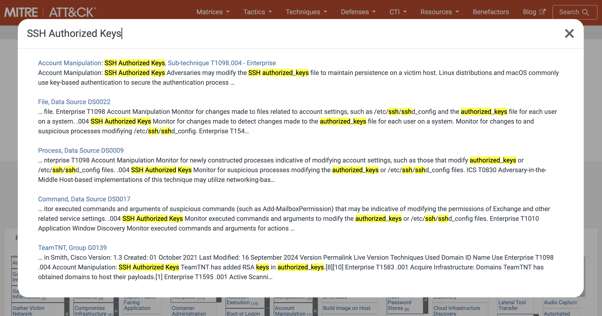

**Key Takeaways**
This case demonstrates how simple credential attacks can evolve into persistent access when paired with known CVEs and poor monitoring. Familiarity with packet analysis, CVE enumeration, and MITRE mapping is important in identifying and mitigating such threats.

